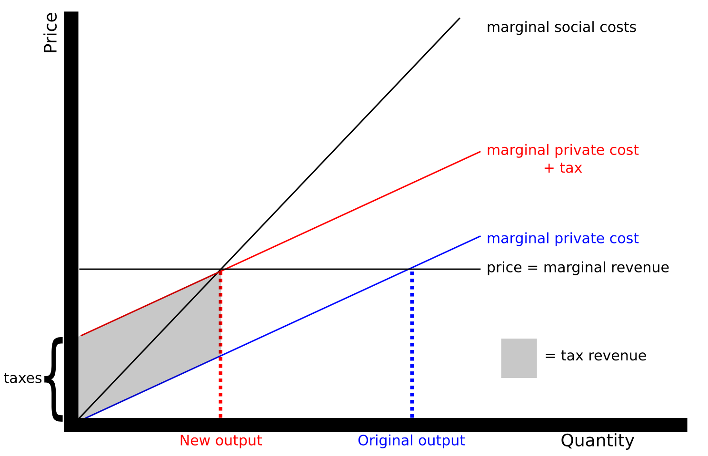

## Transfer pricing
- Transfer pricing is the process of using a price to facilitate decentralized decision making by sharing information and aligning incentives within the firm.

## Transfer pricing
- In simple examples like the initial questions in the Vik-Giger case it is easy to figure out what the price of a product should be. 

## Transfer pricing
- In that case we took for granted that we could easily quantify the costs of making the product.
- We also noted that transferring fixed costs (those that do not vary with output) is not at all simple.

## Cost allocation
- Cost allocation is the process of connecting the sacrifice of resources
  (often a cash outflow) to the process, product, program, or department on
  behalf of which the resources were sacrificed. 

## Cost allocation
- We are trying to track who consumed which resources and when.
- We do this for many reasons and in many different contexts, so there is no
  one approach that is better in every situation.

## Cost allocation
- Note that transfer pricing requires cost allocation, but not all cost
  allocations are done to support transfer pricing.

## Which costs?

- We want to track all costs, but cost allocations focus on _common, indirect,
  and overhead costs_ (all related terms)
- We allocate direct costs, well directly to the activities or products that
  consume them.

## Cost allocation
- Most costs are direct at some point, and then flow into an area of the
  organization where they become indirect. 
- For example, a networking department has many direct costs, but many
  departments access it indirectly. 

## Consider email

- we can easily track who uses it.
- we have good information about how much it costs.
- but it is difficult to define the relationship between email use and value
  creation in the design, manufacturing and sales department.

### Consider aspirin

| Cost                                                | Amount    |
| ------                                              | --------: |
| Two aspirin tablets                                 | \$ 0.040  |
| Direct labor                                        |           |
| Physician                                           | \$ 1.050  |
| Pharmacist                                          | \$ 1.330  |
| Nurse                                               | \$ 0.321  |
| Indirect labor (recordkeeping and orderly)          | \$ 0.800  |
| Cup                                                 | \$ 0.025  |
| Shared and shifted costs                            |           |
| Unreimbursed Medicare                               | \$ 0.450  |
| Indigent care                                       | \$ 0.332  |
| Malpractice insurance and uncollectible receivables | \$ 0.380  |
| Excess bed capacity                                 | \$ 0.429  |
| Other administrative and operating costs            | \$ 0.688  |
| Product cost                                        | \$ 5.845  |
| Hospital overhead costs @ 53.98\%                   | \$ 3.16   |
| Full cost (incl. overhead)                          | \$ 9.000  |
| Profit                                              | \$ 9.000  |
| Price (per dose)                                    | \$18.000  |

### How to find factory costs

> Indirect expense is one of the most important of all the accounts appearing
> on the books of the manufacturer. Methods of handling its \[allocation\] have
> given rise to more arguments than the descent of man. It is the rock upon
> which many a ship of industry has been wrecked.

- Thompson (1916)

## Consider a manufacturing firm

May have many different allocation processes for a single product.

- Taxes (one set of depreciations, and FC allocations)
- Financial reporting
- Government contracts
- Other contracts
- Internal incentives
- Internal cost control

## Reasons to allocate costs

1. External reporting 
2. Taxes
3. Cost-based contracts (esp. gov contracting)
4. Decision making
5. Incentives and accountability ('control')

## Incentive/organizational reasons for cost allocations

- Cost allocations modify behavior a la [Pigouvian taxes](https://en.wikipedia.org/wiki/Pigouvian_tax)
- __All cost allocations, like all taxes, modify behavior__. They are never neutral. 

## Pigouvian tax

## Why do we have common costs?

- The tax analogy helps us think about why cost allocations might be useful.
- But this reasoning doesn't explain why we are 'taxing' aspirin in the hospital example.
- Common costs arise when it is less expensive to provide a good or service centrally.

## Consider the following:

- A firm manufactures spinning hard drives and solid state hard drives
- The two divisions share a building but are separate profit centers
- Managers are compensated based on profits

### How do we treat common costs?

- If we deduct common costs from the manager's profits they will try to reduce common costs
- If we do not, then they will demand more of the common resources
- What we choose will depend on whether the managers can control their consumption of the common costs
- Allocating common costs is widespread, and limits over consumption of common resources

## What is next?

- For students that missed class on Tuesday there will be a make-up solution checking session tonight from 6:30-7:30 in LSK 1026.
- One week from Thursday we will start our discussion of  allocation methods, starting with insulating vs. non-insulating allocations, and moving into chapter 8.
