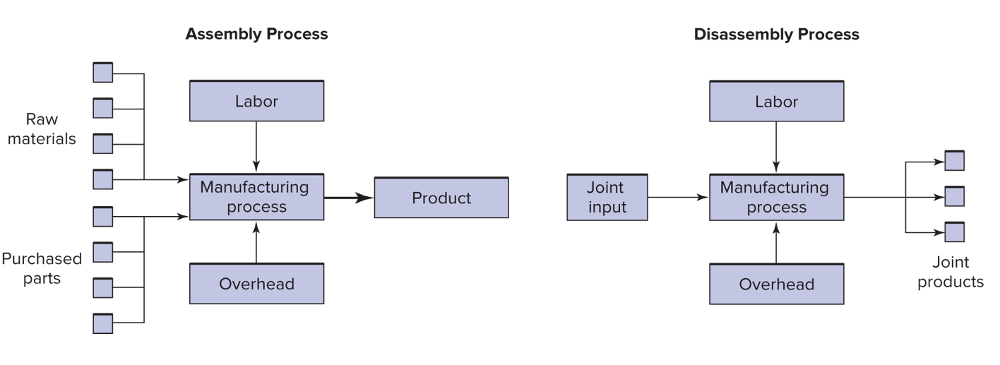

## Step-down method: Does the order matter?

### Does the order matter?

- The costs allocated to Cars and Trucks differ by only \$27,000 depending on whether telecommunications or IT  is chosen first.  
- The difference of \$27,000 is less than 1 percent of the total costs allocated.

### Does the order matter?

- However, very different incentives result depending on which method is used.
- Allocated costs are taxes, and taxes effect behavior.
- And these can lead to the __Death Spiral__ if the tax is too high!

### Illustration

- To illustrate lets expand the telecommunications and IT example.
- Suppose the allocation base in telecommunications is the number of telephones in each department, and
- in IT the allocation base is the number of gigabytes of disk space used.

### Illustration

- Transfer prices are to be established for telephones and gigabytes.
- Allocated costs will be used to compute the transfer prices.

### The allocation bases

|          | Allocation base      |
|----------|----------------------|
| Telecomm | 3,000 Telephones     |
| IT       | 12 million gigabytes |

<!-- if there was more appitite for data analysis we sould spend a lot more time on teh critical question of how best to actually choose allocation bases. -->

### Cost allocated per phone

#### Number of phones

|          | Direct                     | Step, Telecomm first       | Step, IT first             |
|----------|----------------------------|----------------------------|----------------------------|
| Telecoms | --                         | --                         | --                         |
| IT       | --                         | 20% $\times$ 3,000 = 600   | --                         |
| Cars     | 40% $\times$ 3,000 = 1,200 | 40% $\times$ 3,000 = 1,200 | 40% $\times$ 3,000 = 1,200 |
| Trucks   | 30% $\times$ 3,000 = 900   | 30% $\times$ 3,000 = 900   | 30% $\times$ 3,000 = 900   |
| Phones   | 2,100                      | 2,700                      | 2,100                      |

- _Note: that telecom is always '--' here because we are considering how to allocate it's costs. The in the 'IT first' column the telecom costs already include IT costs._

### Cost allocated per phone

|                          |       Direct | Step, Telecomm first |   Step, IT first |
|--------------------------|-------------:|---------------------:|-----------------:|
| Cost per phone           | \$2M/2,100 = |         \$2M/2,700 = | \$3.765M/2,100 = |
|                          |       \$ 952 |               \$ 741 |          \$1,793 |
| Number of phones: Cars   |        1,200 |                1,200 |            1,200 |
| Telecoms charged to Cars |      \$1.143 |              \$0.889 |         \$ 2.151 |

### Does the order matter?

The order can lead to large changes in the 'tax' on the allocation base!

### Cost allocated per Gigabyte of Storage

#### Number of Gigabytes of Storage

|          | Direct                | Step, Telecomm first  | Step, IT first        |
|----------|-----------------------|-----------------------|-----------------------|
| Telecoms | --                    | --                    | 25% $\times$ 12 = 3.0 |
| IT       | --                    | --                    | --                    |
| Cars     | 35% $\times$ 12 = 4.2 | 35% $\times$ 12 = 4.2 | 35% $\times$ 12 = 4.2 |
| Trucks   | 25% $\times$ 12 = 3.0 | 25% $\times$ 12 = 3.0 | 25% $\times$ 12 = 3.0 |
| Gigs     | 7.2                   | 7.2                   | 10.2                  |

- _Note: that IT is always '--' here because we are considering how to allocate it's costs. The in the 'Telecom first' column the IT costs already include Telecom costs._

### Cost allocated per Gigabyte of Storage

|                        | Direct          | Step, Telecomm first | Step, IT first   |
|------------------------|-----------------|----------------------|------------------|
| Cost per gig           | $6/7.2 = $0.833 | $6.44/7.2 = $0.895   | $6/10.2 = $0.588 |
| Number of gigs in Cars | 4.2             | 4.2                  | 4.2              |
| IT charged to Cars     | $3.5            | $3.759               | $2.470           |

##### Cost allocated per Giga of storage (Millions except cost per Gb)

### Consider the impact on behavior

- The sequence of service departments in the step-down method changes the costs of each service.
- Because the cost per phone (which represents the transfer price) varies depending whether or  not it includes IT costs,
- the cost allocation scheme affects the decision of each department to add or drop phones.
- The same conclusions hold for the information technology department.

### Does the order matter?

- Note the wide variation in cost per gigabyte.
- The cost varies from $0.588 per gigabyte under the step-down method with IT chosen first
- to $0.895 under the step-down method with telecommunications chosen first.
- __The step-down method is an example of a sub-optimal status quo.__

### The central issues with the step-down method

- The sequence used is arbitrary and large differences can result in the cost per unit of service using different sequences.
- This creates an artificially low tax on the first department and an artificially high tax on the second department.
- Get this wrong and risk the death spiral.
- If you see the step-down method, find out why.

## The reciprocal method

- __Solves the problem by making the allocation simultaneously__

Start by setting up the equations

### Costs before allocation

| _Consumer:_            | Telecoms | IT   | Cars | Trucks | Total |
|------------------------|----------|------|------|--------|-------|
| _Provider:_            |          |      |      |        |       |
| Telecoms               | 10%      | 20%  | 40%  | 30%    | 100%  |
| IT                     | 25%      | 15%  | 35%  | 25%    | 100%  |
| Cost incurred          | \$2M     | \$6M |      |        | 8M    |
| __Total to allocate:__ | $T$      | $I$  |      |        |       |

$I$ and $T$ are unknown because they include unallocated costs. We need to set up a system of equations and solve it to get these numbers.

### Telecoms equation

- $T$ = Telecom Cost incurred, plus the portion of those costs that Telecom incurred, and the portion of IT that Telecom incurred.
- The equation is:

$$T = \$ 2M + 0.10 \times T + 0.25 \times I$$

- Notice that the $0.10 \times T$ term is decreasing the amount of $T$ to allocate, and $0.25 \times I$ is increasing it.

### Now we algebra a little

- The equation simplifies to:
$$ 0.9\times T =  \$ 2M + 0.25 \times I$$
$$ T =  \$ 2M/.9 + 0.25/.9 \times I $$

### IT equation

- $I$ = IT cost incurred, plus the portion of those costs that IT itself incurred, and  the portion of Telecom that IT incurred.
- The equation is:
$$ I = \$6.0 + .20\times T + .15 \times I $$
$$ .85I=\$6.0+.20\times T$$
- Notice that the  $.15 \times I$ term is decreasing the amount of I to allocate.

### Now algebra a little more

- Now we have two equations and two unknowns and we can solve by hand.
- As a proof of concept now we will use [Google's Colab](https://colab.research.google.com/) platform to solve this

### Pass the following to the colab notebook

``` python
# load symbolic python
import sympy as sp
# initialize I and T
I, T = sp.symbols('I, T')
```

### Now define the equations

``` python
# - use the comma for '='
# - and simplify as little as you like 
tel_eq = sp.Eq(
    2 + .25 * I , .9 * T
)
it_eq = sp.Eq(
    6 + .2 * T , .85 * I
)
```

### Now ask for a solution

``` python
solution = sp.solve((tel_eq, it_eq),(I,T))
```

yields:

`{I: 8.11188811188811, T: 4.47552447552448}`

### This approach is massively scalable

- This approach scales until google starts charging you! And after that until you run out of cash :)
- If we really wanted to have fun we could load weights and costs from a spreadsheet and do the calculation with matrix notation for hundreds of departments.
- Whatever the practice at a company, not knowing the reciprocal allocation is unwise.

### add an equation to illustrate

``` python
I,T,J = sp.symbols('I,T,J')
tel_eq = sp.Eq(
    2 + .25 * I + .12 * J , .9 * T
)
it_eq = sp.Eq(
    6 + .2 * T + .38 * J , .85 * I
)
jt_eq = sp.Eq(
    .1 + .05 * I + .01 * T ,   J
)
solution = sp.solve((tel_eq, it_eq, jt_eq),(I,T,J))
```

### `numpy` version that scales

_for this we need a little more organization:_

$$ .25 \times I + .12 \times J - .9 \times T = -2$$
$$-.85 \times I + .38 \times J + .2 \times T = -6$$
$$ .05 \times I - J + .01 \times T = -.1$$

### then we can load this from a csv, or type the following

``` python
import numpy as np
lhs = np.array([
    [.25,.12,-.9],
    [-.85,.38,.2],
    [.05,-1,.01]
               ])
rhs = np.array(
    [-2,-6,-.1]
)
np.linalg.solve(lhs,rhs)
```

### Service department cost allocation

| _Consumer:_               | Telecoms                   | IT                         | Cars                       | Trucks                     | Total   |
|---------------------------|----------------------------|----------------------------|----------------------------|----------------------------|---------|
| _Provider:_               |                            |                            |                            |                            |         |
| Costs before allocation   | \$2M                       | \$6M                       |                            |                            | \$8M    |

### Service department cost allocation

| _Consumer:_               | Telecoms                   | IT                         | Cars                       | Trucks                     | Total     |
|---------------------------|----------------------------|----------------------------|----------------------------|----------------------------|-----------|
| _Provider:_               |                            |                            |                            |                            |           |
| Costs before allocation   | \$2M                       | \$6M                       |                            |                            | \$8M      |
| Telecoms tot. to alloc.   | \$(4.475)                  |                            |                            |                            | \$(4.475) |

### Service department cost allocation

| _Consumer:_                     | Telecoms                   | IT                         | Cars                       | Trucks                     | Total     |
|---------------------------------|----------------------------|----------------------------|----------------------------|----------------------------|-----------|
| _Provider:_                     |                            |                            |                            |                            |           |
| Costs before allocation         | \$2M                       | \$6M                       |                            |                            | \$8M      |
| Telecoms tot. to alloc.         | \$(4.475)                  |                            |                            |                            | \$(4.475) |
| Amount allocated from Telecoms: | $\$4.475\times.10=\$.448$  | $\$4.475\times.20=\$.895$  | $\$4.475\times.40=\$1.790$ | $\$4.475\times.30=\$1.34.$ | \$4.475   |

### Service department cost allocation

| _Consumer:_                     | Telecoms                   | IT                         | Cars                       | Trucks                     | Total     |
|---------------------------------|----------------------------|----------------------------|----------------------------|----------------------------|-----------|
| _Provider:_                     |                            |                            |                            |                            |           |
| Costs before allocation         | \$2M                       | \$6M                       |                            |                            | \$8M      |
| Telecoms tot. to alloc.         | \$(4.475)                  |                            |                            |                            | \$(4.475) |
| Amount allocated from Telecoms: | $\$4.475\times.10=\$.448$  | $\$4.475\times.20=\$.895$  | $\$4.475\times.40=\$1.790$ | $\$4.475\times.30=\$1.34.$ | \$4.475   |
| IT  tot. to alloc               |                            | \$(8.112)                  |                            |                            | \$(8.112) |

### Service department cost allocation

| _Consumer:_                     | Telecoms                   | IT                         | Cars                       | Trucks                     | Total     |
|---------------------------------|----------------------------|----------------------------|----------------------------|----------------------------|-----------|
| _Provider:_                     |                            |                            |                            |                            |           |
| Costs before allocation         | \$2M                       | \$6M                       |                            |                            | \$8M      |
| Telecoms tot. to alloc.         | \$(4.475)                  |                            |                            |                            | \$(4.475) |
| Amount allocated from Telecoms: | $\$4.475\times.10=\$.448$  | $\$4.475\times.20=\$.895$  | $\$4.475\times.40=\$1.790$ | $\$4.475\times.30=\$1.34.$ | \$4.475   |
| IT  tot. to alloc               |                            | \$(8.112)                  |                            |                            | \$(8.112) |
| Amount allocated from IT:       | $\$8.112\times.25=\$2.028$ | $\$8.112\times.15=\$1.217$ | $\$8.112\times.35=\$2.839$ | $\$8.112\times.25=\$2.028$ | \$8.112   |

### Service department cost allocation

| _Consumer:_                     | Telecoms                   | IT                         | Cars                       | Trucks                     | Total     |
|---------------------------------|----------------------------|----------------------------|----------------------------|----------------------------|-----------|
| _Provider:_                     |                            |                            |                            |                            |           |
| Costs before allocation         | \$2M                       | \$6M                       |                            |                            | \$8M      |
| Telecoms tot. to alloc.         | \$(4.475)                  |                            |                            |                            | \$(4.475) |
| Amount allocated from Telecoms: | $\$4.475\times.10=\$.448$  | $\$4.475\times.20=\$.895$  | $\$4.475\times.40=\$1.790$ | $\$4.475\times.30=\$1.34.$ | \$4.475   |
| IT  tot. to alloc               |                            | \$(8.112)                  |                            |                            | \$(8.112) |
| Amount allocated from IT:       | $\$8.112\times.25=\$2.028$ | $\$8.112\times.15=\$1.217$ | $\$8.112\times.35=\$2.839$ | $\$8.112\times.25=\$2.028$ | \$8.112   |
| Total overhead allocated        | 0.000                      | 0.000                      | \$4.629                    | \$3.371                    | \$8.000   |

### Cost per phone

|                              | Telecoms     | IT           | Cars        | Trucks      | Total        |
|------------------------------|--------------|--------------|-------------|-------------|--------------|
| Allocated Telecoms costs (M) | \$ 0.448     | \$ 0.895     | \$1.790     | \$1.343     | \$ 4.475     |
| ÷ Number of phones           | 300          | 600          | 1,200       | 900         | 3,000        |
| __Cost per phone (M)__       | __\$ 1,492__ | __\$ 1,492__ | __\$1,492__ | __\$1,492__ | __\$ 1,492__ |

### Cost per gig

|                           | Telecoms     | IT           | Cars        | Trucks      | Total        |
|---------------------------|--------------|--------------|-------------|-------------|--------------|
| Allocated IT costs        | \$ 2.028     | \$ 1.217     | \$2.839     | \$2.028     | \$ 8.111     |
| ÷ Number of gigabytes (M) | 3.0          | 1.8          | 4.2         | 3.0         | 12.0         |
| Cost per gigabyte         | __\$ 0.676__ | __\$ 0.676__ | __\$0.676__ | __\$0.676__ | __\$ 0.676__ |

### Ask why

> _The fact that we observe infrequent use of the reciprocal method suggests
> that accounting's primary focus is not decision making, but rather some other
> purpose such as financial reporting, or taxes._

# Joint costs

### Joint costs



## Joint costs and the death spiral

### Chickens in the death spiral

- a chicken processor who buys live chickens and disassembles them into fillets, wings, and drumsticks.
- chickens cost $1.60 each.
- variable cost to process the chicken into parts is $0.40 per chicken.
- The joint cost per chicken is then $2.

### Chickens in the death spiral

- separate processing is necessary to obtain marketable fillets, drumsticks, and wings.
- cost of $0.80 for fillets, $0.16 for wings, and $0.04 for drumsticks.
- the split-off point occurs where all joint costs have been incurred.

### Chickens in the death spiral

|                              | Total  | Fillets | Drumsticks | Wings    |
|------------------------------|--------|---------|------------|----------|
| Cost alloc. on weight        |        |         |            |          |
| Weight                       | 32 oz  | 16 oz   | 12 oz      | 4 oz     |
| %                            | 100%   | 50%     | 37.5%      | 12.5%    |
| Alloc'd cost                 | \$2.00 | \$1.00  | \$0.75     | \$ 0.25  |
| _Profit_                     |        |         |            |          |
| Sales                        | \$3.50 | \$2.40  | \$0.80     | \$ 0.30  |
| Costs beyond split-off point | (1.00) | (0.80)  | (0.04)     | (0.16)   |
| Joint costs (from above)     | (2.00) | (1.00)  | (0.75)     | (0.25)   |
| Profit (loss) per chicken    | \$0.50 | \$0.60  | \$0.01     | \$(0.11) |

Management decides to drop chicken wings.

### Chickens in the death spiral

|                              | Total  | Fillets | Drumsticks |
|------------------------------|--------|---------|------------|
| Cost alloc. on weight        |        |         |
| Weight                       | 28 oz  | 16 oz   | 12 oz      |
| %                            | 100%   | 57.14%  | 42.9%      |
| Alloc'd cost                 | \$2.00 | \$1.14  | \$0.86     |
| _Profit_                     |        |         |            |
| Sales                        | \$3.20 | \$2.40  | \$0.80     |
| Costs beyond split-off point | (0.84) | (0.80)  | (0.04)     |
| Joint costs (from above)     | (2.00) | (1.14)  | (0.86)     |
| Profit (loss) per chicken    | \$0.36 | \$0.46  | \$(0.10)   |

Management decides to drop chicken drumsticks.

### Chickens in the death spiral

|                              | Fillets  |
|------------------------------|----------|
| Weight                       | 16 oz    |
| %                            | 100%     |
| Alloc'd cost                 | \$2.00   |
| _Profit_                     |          |
| Sales                        | \$2.40   |
| Costs beyond split-off point | (0.80)   |
| Joint costs (from above)     | (2.00)   |
| Profit (loss) per chicken    | \$(0.40) |

Management decides that they were vegan all along and start selling cans of air from exotic locations.

### So what's wrong?

- the transfer of 25 cents to wings makes us think that we can avoid these costs if we stop making wings but we cannot
- the only costs and benefits considered in the decision to process further should be the actual costs and benefits that occur after we process further.
- consider the opportunity costs! What are the benefits foregone?

## Net realizable value

- the benefit foregone if we do not process further
- this is the only metric we should use __when considering elimination of joint products__.
- other transfer prices may be used to align decisions with company goals.

### Net realizable value


The NRV of chicken wings is $\$0.30-\$0.16=\$0.14$
