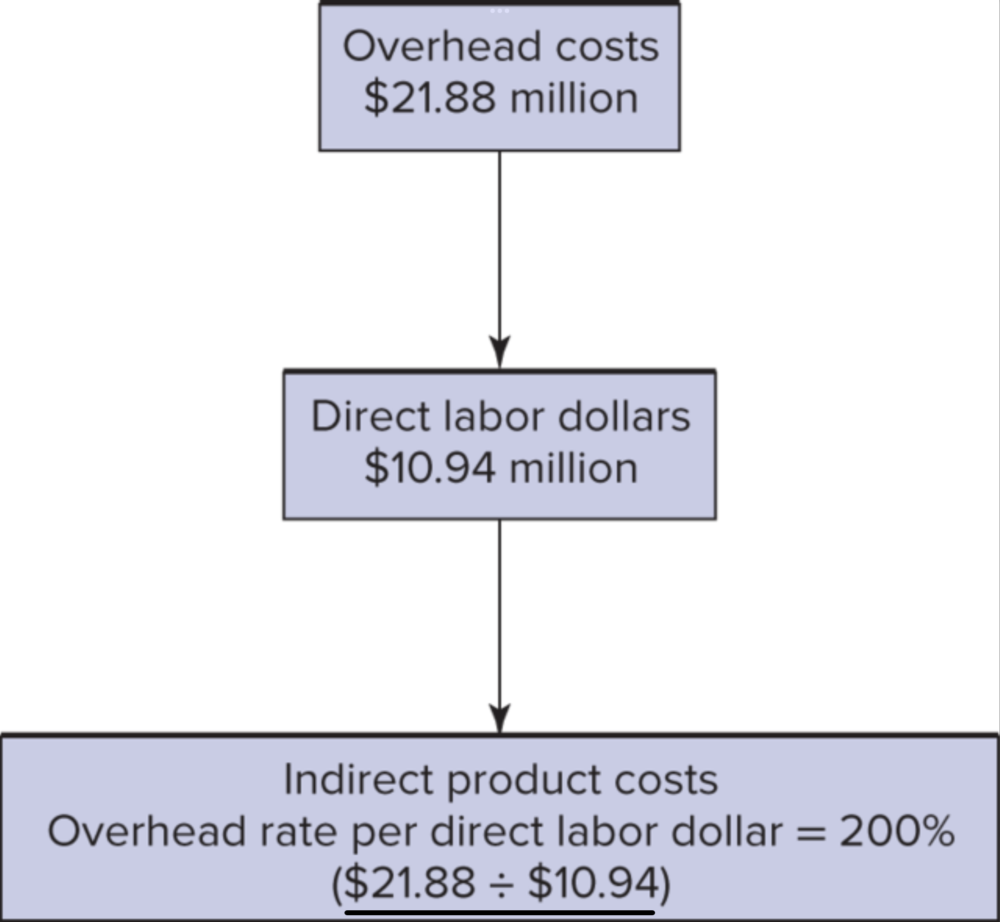

## Addressing the Criticisms of Absorption Cost Systems with Activity Based Costing (ABC)

### Outline of our discussion of absorption costing:

- In this lecture we will introduce activity-based costing (ABC) and compare it
  to traditional absorption costing.
- The last several lectures began the discussion of absorption costing, and
  it's discontents.

### Outline of our discussion of absorption costing:

- We also discussed how changes in performance measurement require changes in
  other parts of organizational architecture (performance measurement and
  decision rights partitioning).

### Problems with absorption costing:

1. Allocating fixed costs on a unit basis makes the seem variable.
    - The death spiral
    - Bad outsourcing choices
2. Incentive to overproduce.
    - Earnings manipulation.
### Alternatives have problems too:

- Ignoring (i.e. not allocating) fixed costs leads to incentives to over invest.
  - Not allocating makes the fixed costs seem free (_gratis_ not _libre_). May need to centralize investment decisions with this method as well.
- Allocating fixed costs all at once (i.e. variable costing) may lead to underinvestment:
  - The manager's horizon (i.e. planned career with the company) may not match the horizon of the company.
  - Off-setting the reputation effects of reduced earnings may be hard.
  - This leads to specialist managers (i.e. who specialize in executing large investments/restructuring).
  - Also leads to direct incentives to invest. Executive compensation plans often specifically mention investments. This is a hybrid approach to centralizing the investment decision.

### One more problem: Inaccurate Product Costs

- __multiple products__, absorption costing often does not
  accurately represent the opportunity costs of different products.
- Absorption costing uses few input factors, such as
  direct labor hours or machine hours, to allocate overhead costs

### One more problem: Inaccurate Product Costs

- Absorption costing does not clearly show how costs are influenced by the
  diversity and complexity of production processes.
- Absorption cost systems assign too few costs to small batches and complex
  special orders.

### ABC’s Major Features

- Better identifies activities that drive costs
- Tracks set-up costs associated with each batch and product line
- Analyzes activities rather than input resources
- Allows cost drivers to vary across the firm. 

### ABC’s Major Features

- Cost analysts attempt to identify cause-and-effect cost drivers for
  allocating overhead costs.
- Reduces overhead cost pools that are allocated with an arbitrary allocation
  base.

### Classifying ABC Cost Drivers

Classify cost drivers into one of four categories:

1. Unit-level
2. Batch-level
3. Product-level
4. Production-sustaining

### ABC isn't really anything new:

- Indirect costs are classified as 'indirect' not because they are __impossible__ to directly track, but because they are __difficult__ to directly track. 
- ABC is essentially the decision to track costs _more_ directly.
- This has several effects:
  - Some fixed overheads are not truely fixed (or overheads).
  - Can reduce the portion of fixed costs in any one allocation, diffusing the perverse incentives we've been discussing.
  - Most importantly, ABC can help isolate costs from production decisions.

  
### ABC allows us to isolate costs from production decisions

- This is core to overproduction, death spirals, and incorrect outsourcing
  choices.

### ABC allows us to isolate costs from production decisions

{ width=75% }

### ABC allows us to isolate costs from production decisions

- _Notice the separation of unit-level costs (and decisions) from batch, and product level decisions._ 
- More detailed cost allocation allows us to ignore fixed costs when we make _unit-level_ decisions and then consider them when we make decisions at other levels.
- This allows us to consider the costs of investment decisions (i.e. fixed costs) when we make them, and set them aside when we do not.
- Can help avoid the death spiral, and outsourcing mistakes.

### Unit-level Costs

- __Unit-level costs__: activities that are performed at least once for each
  unit of product
- Total amount of unit-level costs is a linear function of the quantity
  produced.

Examples:

- Direct labor and direct material
- Machine servicing related to number of units produced

### Batch-level Costs

- __Batch-level costs__: activities that are performed once for each batch of products
- Batch-level costs are independent of the number of units in the batch.

Examples:

- Indirect labor, such as production supervisors
- Machine set-ups
- Moving batches

### Product-level Costs

- __Product-level costs__: activities that support production of a product type or model
- Product-level costs do not vary with the number of batches produced.

Examples:

- Engineering support
- Equipment usable for only one product line

### Production-sustaining Costs

- __Production-sustaining costs:__ all remaining activities required for
  overall operation of production facility
- Production-sustaining costs do not depend on number of units, batches, or
  product lines.

Examples:

- Plant security, insurance, general maintenance
- Plant accounting and administration

### Example: ABC vs. Absorption

- __Similarities:__ Direct and unit-level costs are allocated the same.
- __Differences:__ ABC allocates more indirect costs to products with smaller
  production volume and more complex set-up. This is _more accurate_.

### Absorption costing schematic

{ width=50% }

### ABC costing schematic

{ width=50% }

### Two questions:

- Is this simple?
- Is this transparent?

### Two questions:

When we answer these questions, we also have to make sure that we are
accurately comparing the two methods. We want to achieve our goals with methods
that are simple and transparent, but the methods we choose between must
_actually achieve our goals_.

### Example: ABC vs. Absorption

Consider the following example where models 801 and 901 are more complex/lower
volume products.

| Model number             |   105    |   205   |   305 |   801 |   901 |
|--------------------------|----------|---------|-------|-------|-------|
| Batches per year         | 800      | 1,000   | 600   | 400   | 200   |
|   (100 units/batch)      |          |         |       |       |       |
| Absorption cost per unit | \$162    | \$169   | \$173 | \$206 | \$217 |
| ABC cost per unit        | \$157    | \$162   | \$164 | \$234 | \$242 |
| Difference               | -3%      | -4%     | -5%   | +14%  | +12%  |

### Kiddo Inc Example <!-- from ch 10 --> 

Kiddo Incorporated manufactures running shoes. Recently, it added a new line of
pump sneakers. Over the past two years, sales of both the Runner and the Pump
have been flat at 5,000,000 and 2,400,000 pairs, respectively. However, in
anticipation of increased sales, production was increased from 5,140,000 to
5,200,000 for the Runner and from 3,000,000 to 3,564,000 for the Pump from year
1 to year 2.

### Kiddo Inc Example

Production costs for the two sneakers are very different. Materials cost
\$14.00 per Runner and \$17.75 per Pump. Labor costs are \$4.60 and \$5.00 and
variable overhead costs are \$6.60 and \$7.30 for the Runner and the Pump,
respectively. Fixed overhead costs are \$50 million and are allocated based on
direct labor cost. Kiddo uses LIFO.

### Kiddo Inc Example: Year 1 Absorption Income statement 

|                          | Runner        | Pump          | Total         |
|--------------------------|---------------|---------------|---------------|
| Revenue                  | \$160,000,000 | \$110,400,000 | \$270,400,000 |
| Expenses:                |               |               |               |
| Material                 | 70,000,000    | 42,600,000    | 112,600,000   |
| Labor                    | 23,000,000    | 12,000,000    | 35,000,000    |
| Variable overhead        | 33,000,000    | 17,520,000    | 50,520,000    |
| __Fixed overhead$^{*}$__ | 29,650,000    | 15,480,000    | 45,130,000    |
| Net income               | \$ 4,350,000  | \$ 22,800,000 | \$ 27,150,000 |

### Kiddo Inc Example: Year 1 Fixed Overhead rate 

First, find the fixed overhead rate per unit of the allocation base (direct labor dollars): 

|                       | Runner       | Pump         | Total            |
|-----------------------|--------------|--------------|------------------|
| Direct labor per pair | \$ 4.60      | \$5.00       |                  |
| × Units produced      | 5,140,000    | 3,000,000    |                  |
| Direct labor cost     | \$23,644,000 | \$15,000,000 | __\$38,644,000__ |

- Fixed overhead: 
$$50,000,000 / \$38,644,000 =\$1.29$$
<!-- $$\frac{50,000,000}{\$38,644,000}=\$1.29$$ -->

### Kiddo Inc Example: Year 1 FOH allocation

|                               | Runner       | Pump         | Total        |
|-------------------------------|--------------|--------------|--------------|
| Direct labor per pair         | \$4.60       | \$5.00       |              |
| $\times$ FOH rate             | \$1.29       | \$1.29       |              |
| FOH per pair                  | \$5.93       | \$6.45       |              |
| $\times$ Number of pairs sold | 5,000,000    | 2,400,000    |              |
| FOH Allocated                 | \$29,650,000 | \$15,480,000 | \$45,130,000 |

### Kiddo Inc Example
<!-- from ch 11 -->

Further analysis of Kiddo's production process has allowed it to allocate costs
using activity-based costing. Engineering costs, rework expenses, and equipment
maintenance and depreciation were estimated for each production line.

### Kiddo Inc Example

Product-line costs for the Runner and Pump sneakers are \$5 million and \$12
million, respectively. Setup costs for each batch are \$2,500. The batch size
for the Runner is 1,000 pairs of sneakers. The batch size for the Pump in year
1 is 500 pairs and 600 pairs for year 2. Remaining fixed overhead costs total
\$5,150,000 and were allocated based on direct labor cost.

### Kiddo Inc Example: Year 1 ABC Income statement

|                              | Runner        | Pump          | Total         |
|------------------------------|---------------|---------------|---------------|
| Revenue                      | \$160,000,000 | \$110,400,000 | \$270,400,000 |
| Expenses:                    |               |               |               |
| Material                     | \$70,000,000  | \$42,600,000  | \$112,600,000 |
| Labor                        | \$23,000,000  | \$12,000,000  | \$35,000,000  |
| Variable overhead            | \$33,000,000  | \$17,520,000  | \$50,520,000  |
| Gross margin                 | \$ 34,000,000 | \$ 38,280,000 | \$ 72,280,000 |
| __Batch costs$^{*}$__        | \$12,500,000  | \$12,000,000  | \$24,500,000  |
| __Product-line costs$^{*}$__ | \$4,863,813   | \$9,600,000   | \$14,463,813  |
| __Fixed overhead$^{*}$__     | \$3,065,159   | \$1,599,213   | \$4,664,372   |
| Net profit                   | \$ 13,571,028 | \$ 15,080,787 | \$ 28,651,815 |

### Kiddo batch costs

|                       | Runner       | Pump         |
|-----------------------|--------------|--------------|
| Cost per batch        | \$ 2,500     | \$ 2,500     |
| × Units sold          | 5,000,000    | 2,400,000    |
| ÷ Units per batch     | 1,000        | 500          |
| Allocated batch costs | \$12,500,000 | \$12,000,000 |

### Kiddo product-line costs

 |                          | Runner       | Pump         |
 |--------------------------|--------------|--------------|
 | Total product-line costs | \$5,000,000  | \$12,000,000 |
 | ÷ Units produced         | 5,140,000    | 5,000,000    |
 | × Units sold             | 3,000,000    | 2,400,000    |
 | Allocated line costs     | \$ 4,863,813 | \$ 9,600,000 |

### Kiddo Fixed Overhead Costs 
 
|                                    | Runner       | Pump         | Total        |
|------------------------------------|--------------|--------------|--------------|
| Remaining fixed overhead           |              |              | \$ 5,150,000 |
| Units produced                     | 5,140,000    | 3,000,000    |              |
| × Direct labor per pair            | \$4.60       | \$5.00       |              |
| Total labor cost                   | \$23,644,000 | \$15,000,000 | \$38,644,000 |
| Fixed overhead per direct labor \$ |              |              | \$ 0.1333    |
| Direct labor of units sold         | \$23,000,000 | \$12,000,000 |              |
| Fixed overhead allocated           |              |              |              |
| (× \$0.1333)                       | \$ 3,065,159 | \$ 1,599,213 |              |

### ABC and Decision Making

- ABC improves pricing decisions because product costs are presumably more
  accurate estimates of opportunity cost. 
- Low-volume high-complexity products should get higher prices or be dropped.
  The benefit here is that this decision will be based on the actual avoidable
  costs.
- ABC focuses attention on reducing use of activities that are most associated
  with costs.

<!-- ## Review the Insteel Industries example. -->

<!-- TODO: add the insteel industries example here -->

### ABC and Decision Control

- ABC requires more monitoring.
- Time to identify and measure activities.
- Meetings to resolve disputes over activity drivers
- ABC shifts decision rights over activity drivers to lower-level managers with
  specialized knowledge of the relation between costs and activities.
- Departmental managers could opportunistically pick cost drivers that maximize
  their performance rewards.

<!-- ### What is the Optimal Number of Cost Drivers? -->
<!-- ## Consider Figure 11-4 -->
<!-- _The optimal number of drivers is less for decision management and control than it is for decision management only._ -->

<!-- Why is this? -->

<!-- 3K. Merchant and M. Shields, “When and Why to Measure Costs Less Accurately to Improve Decision Making,” Accounting Horizons, June 1993, pp․ 76–81 -->

<!-- TODO: consider modernizing this discussion in both the literature and the text. This is the sort of paper that would be fun to run and gun with Matt, possibly a PhD student as well. -->
<!-- I'm, in general, skeptical of this assumption and paper, AOS might be a nice place to land this sort of thing -->

### ABC Measures Costs,  Not Benefits

- ABC does not measure the benefits of producing/selling multiple products.
- Firms offer multiple products because of economies of scale and scope.
- ABC allocates common costs -- not the common or joint benefits of multiple products.

### History of ABC

- Pre-cursors of ABC were efforts to improve cost allocations in 19th century businesses.
- Activity-based costing terminology was invented and popularized in the late 1980s to early 1990s.
- In the later 1990s and up to the present, the success of ABC systems has been mixed and alternative strategies have been successfully applied to achieve some of the same benefits of ABC with less cost.

### ABC Cost Accumulation and Allocation

<!-- The bookkeeping for ABC is similar to the two-stage allocation procedure in  -->

<!-- Figure 9-4. -->

1. Unit-level costs are directly assigned to products.
2. Indirect costs are accumulated in the appropriate activity cost pools.
3. Indirect costs are allocated from the activity cost pools using the batch,
   product, and production-sustaining cost drivers.

### Acceptance of ABC is evolving with internal information systems

- When data collection, management and analysis were expensive and difficult ABC was also expensive and difficult.
- So, although many controllers were interested in ABC, adoption was slow.
- Now, however, most companies already gather much of the needed information as a part of other systems.
- Today, implementing ABC requires management and analysis of data generated throughout the organization. [ATK](https://www.google.com/maps/dir/Northrop+Grumman+Innovation+Systems,+9160+UT-83,+Corinne,+UT+84307,+United+States/Thiokol+Airport,+Howell,+UT,+USA/South+Jordan,+UT,+USA/@41.1309497,-113.4849556,8z/data=!3m1!4b1!4m20!4m19!1m5!1m1!1s0x8753600f58990353:0x7fe5d3fd145c71bd!2m2!1d-112.4410895!2d41.6595695!1m5!1m1!1s0x8754b06ca20133f5:0xb8e5325871588433!2m2!1d-112.4466328!2d41.7138145!1m5!1m1!1s0x875285898dabc993:0xf566008fdec9b355!2m2!1d-111.929658!2d40.5621704!3e0)

### ABC for strategic analysis rather than to replace absorption costing:

- Absorption required for external reporting
- ABC for strategic analysis and special studies
- ABC is most likely to be adopted by:
- Manufacturers in price-sensitive competitive markets
- Large plants with many different products and processes

### Cost Allocation and Automation

- In highly automated plants where direct labor costs are a small share of total costs, using machine hours as an activity base gives more accurate cost than direct labor.
- Automation improves efficiency and eliminates bottlenecks so that less indirect labor is needed for moving, inspecting, and expediting products.

### Cost Allocation as a Tax System  
(Motivation versus Accuracy)

- Cost allocations are an internal tax system that motivate mangers to use less of resources with high cost allocations. (Chapter 7).
- Cycle time: Zytec uses total time to manufacture the product as its allocation base to motivate managers to reduce cycle time. 
- Direct labor: Hitachi allocates overhead on direct labor hours so that managers improve automation as a way to eliminate costly direct labor.

<!-- ### How does ABC relate to the cost functions we were writing in the beginning of the course? -->
<!--  cost systems can be related back to the discussion of cost curves in [ Chapter 2. L Chapter 2 presented a linear cost curve of the form -->
<!-- TC = VC × 0 + FC -->
<!-- where -->
<!-- TC = Total cost -->
<!-- VC = Variable cost per unit -->
<!-- 0 = Number of units produced -->
<!-- FC = Fixed cost -->
<!-- That is, total cost, TC, can be disaggregated into variable costs, VC × Q, and fixed cost, FC. Fixed costs, by definition, do not vary with Q, units produced. -->
<!-- Activity-based costing assumes a more complex cost function-namely, -->
<!-- TC = VCx 0 + BC X B + PC XL + OC -->
<!-- where -->
<!-- TC = Total cost -->
<!-- VC = Variable cost ver unit -->
<!-- 0 = Number of units produced -->
<!-- BC = Cost per batch -->
<!-- B = Number of batches -->
<!-- PC = Cost per product line -->
<!-- L = Number of product lines -->
<!-- OC = All other costs that do not vary with some activity measure -->
<!-- In addition. -->
<!-- FC = BC X B+ PCXL + OC -->
<!-- That is, some fixed costs, FC, that do not vary with units produced do vary with the number of batches and product lines. -->
