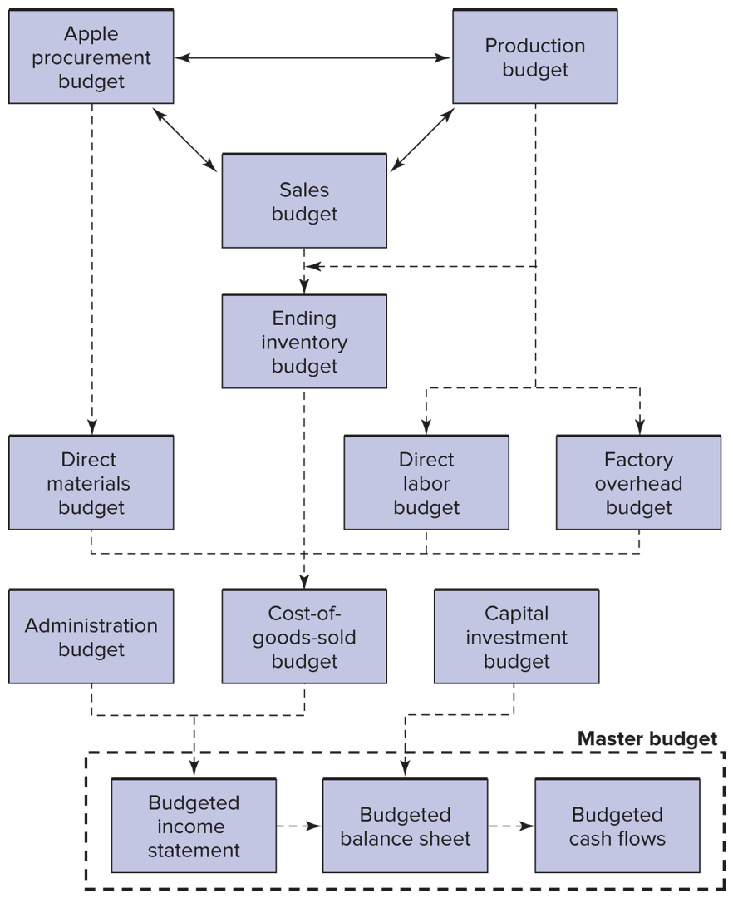

### Everything starts with a budget

- We can conduct variance analysis at any level of the organization.
- We can use decomposition of variances to isolate the causes.
- This tells us which parts of our forecasts were wrong.

### Logical flow

## Example: Sandy Cove Bank

### Sandy Cove Bank

- Sandy Cove is a new small commercial bank in Sandy Cove, Michigan.
- The bank limits interest rate risk by matching the maturity of its assets to
  the maturity of its liabilities.
- By maintaining a spread between interest rates charged and interest rates
  paid, the bank plans to earn a small income.

### Sandy Cove Bank

- Management establishes a flexible budget based on interest rates for each
  department.
- The Boat and Car Loan Department offers five-year loans.
- It matches certificates of deposit (CDs) against car and boat loans.

### Sandy Cove Bank

- Given all the uncertainty about interest rates, management believes that
  five-year savings interest rates could vary between 2 percent and 16 percent
  for the coming year. (_Note: 'Given' in this sentence embeds a critical
  management accounting activity: forecasting._)
- The savings rate is the rate paid on CD savings accounts.
- The loan rate is the rate charged on auto and boat loans. 

### Sandy Cove Bank

- Expected new demand for fixed-rate, five-vear loans and the new supply of
  fixed-rate, five-year savings accounts at various interest rates.

| Loan Rate | Loan Demand  | Savings Rate | Savings Supply |
|-----------|--------------|--------------|----------------|
| 6%        | \$12,100,000 | 2            | \$ 4,700,000%  |
| 7%        | 10,000,000   | 3            | 5,420,000      |
| 8%        | 8,070,000    | 4            | 8,630,000      |
| 9%        | 6,030,000    | 5            | 9,830,000      |
| 10%       | 4,420,000    | 6            | 11,800,000     |

- There are no loans from previous years. Note that the department maintains a
  4 percent spread between loan and savings rates to cover processing, loan
  default, and overhead.

### Sandy Cove Bank

- The amount of new loans granted is always the lesser of the loan demand and
  loan supply.
- For simplicity, this bank may lend 100 percent of deposits.
- In practice, this rate is set by policy makers and regulators not the bank itself.

### Sandy Cove Bank

- Although rates are set nationally, the bank may pay or charge slightly
  different rates to limit demand or boost supply as needed in its local
  market.
- The Boat and Car Loan Department incurs processing, loan default, and
  overhead expenses related to these accounts.

### Sandy Cove Bank

- The first two expenses vary, depending on the dollar amount of the accounts.
- The annual processing expense is budgeted to be 1.5 percent of the loan
  accounts. 
- Default expense is budgeted at 1 percent of the amount loaned per year.

### Sandy Cove Bank

- Again, loans and savings would ideally be the same.
- Overhead expenses are estimated to be \$30,000 for the year, regardless of the
  amount loaned.

### SCB Question 1

1. Calculate the processing, loan default, and overhead expenses for each possible interest rate.

| Loan Rate | Loan Demand | Savings Rate | Savings Supply | New Loans |
|-----------|-------------|--------------|----------------|-----------|
| 6%        | \$12.1 M    | 2%           | \$ 4.7 M       | \$ 4.7 M  |
| 7%        | 10          | 3%           | 5.42           | 5.42      |
| 8%        | 8.07        | 4%           | 8.63           | 8.07      |
| 9%        | 6.03        | 5%           | 9.83           | 6.03      |
| 10%       | 4.42        | 6%           | 11.8           | 4.42      |

### SCB Solution 1

| Loan Rate | Loan Demand | Savings Rate | Savings Supply | New Loans | Processing Expenses |
|-----------|-------------|--------------|----------------|-----------|---------------------|
| 6%        | \$12.1 M    | 2%           | \$ 4.7 M       | \$ 4.7 M  | \$70,500            |
| 7%        | 10          | 3%           | 5.42           | 5.42      | 81,300              |
| 8%        | 8.07        | 4%           | 8.63           | 8.07      | 121,050             |
| 9%        | 6.03        | 5%           | 9.83           | 6.03      | 90,450              |
| 10%       | 4.42        | 6%           | 11.8           | 4.42      | 66,300              |

- Processing is 1.5% of loan accounts

### SCB Solution 1

| Loan Rate | Loan Demand | Savings Rate | Savings Supply | New Loans | Processing Expenses | Default Exp |
|-----------|-------------|--------------|----------------|-----------|---------------------|-------------|
| 6%        | \$12.1 M    | 2%           | \$ 4.7 M       | \$ 4.7 M  | \$70,500            | \$47,000    |
| 7%        | 10          | 3%           | 5.42           | 5.42      | 81,300              | 54,200      |
| 8%        | 8.07        | 4%           | 8.63           | 8.07      | 121,050             | 80,700      |
| 9%        | 6.03        | 5%           | 9.83           | 6.03      | 90,450              | 60,300      |
| 10%       | 4.42        | 6%           | 11.8           | 4.42      | 66,300              | 44,200      |

- Default expense is budgeted at 1 percent of the amount loaned per year.

### SCB Solution 1

| Loan Rate | Loan Demand | Savings Rate | Savings Supply | New Loans | Processing Expenses | Default Exp | Overhead Expenses |
|-----------|-------------|--------------|----------------|-----------|---------------------|-------------|-------------------|
| 6%        | \$12.1 M    | 2%           | \$ 4.7 M       | \$ 4.7 M  | \$70,500            | \$47,000    | \$30,000          |
| 7%        | 10          | 3%           | 5.42           | 5.42      | 81,300              | 54,200      | 30,000            |
| 8%        | 8.07        | 4%           | 8.63           | 8.07      | 121,050             | 80,700      | 30,000            |
| 9%        | 6.03        | 5%           | 9.83           | 6.03      | 90,450              | 60,300      | 30,000            |
| 10%       | 4.42        | 6%           | 11.8           | 4.42      | 66,300              | 44,200      | 30,000            |

- These are the budgeted expenses, this is the foundation of financing plans to
  make sure that these resources are in place when they are needed.
- In this case it is the deposits that need to be in place for the lending to
  happen.
  

### SCB Question 2

2. Create an annual budgeted income statement for five-year loans and deposits
   for the Boat and Car Loan Department given a savings interest rate of 4
   percent. Remember to match supply and demand.

|                     |                   |           |
|---------------------|-------------------|-----------|
| Interest income     | \$8,070,000 × 8%= | \$645,600 |
| Interest expense    | \$8,070,000 × 4%= | 322,800   |
| Net interest income |                   | \$322,800 |
| Fixed overhead      |                   | 30,000    |
| Processing expense  |                   | 121,050   |
| Default expense     |                   | 80,700    |
| Net income          |                   | \$ 91,050 |

### SCB Question 3

3. Table 2 shows the actual income statement for the Boat and Car Loan
   Department. Included are the actual loans and savings for the same period.
   Calculate the variances and provide a possible explanation.

|                     | Budget    | Actual      |
|---------------------|-----------|-------------|
| Interest income     | \$645,600 | \$ 645,766  |
| Interest expense    | 322,800   | 314,360     |
| Net interest income | \$322,800 | \$ 331,406  |
| Fixed overhead      | 30,000    | 30,200      |
| Processing expense  | 121,050   | 130,522     |
| Default expense     | 80,700    | 77,800      |
| Net income          | \$ 91,050 | \$ 92,884   |
| Loans               | 8,070,000 | \$8,062,000 |
| Deposits            | 8,070,000 | \$8,123,000 |

### SCB Solution 3

|                     | Budget    | Actual      | Fav. (Unfav.) Variance |
|---------------------|-----------|-------------|------------------------|
| Interest income     | \$645,600 | \$ 645,766  | \$ 166                 |
| Interest expense    | 322,800   | 314,360     | 8,440                  |
| Net interest income | \$322,800 | \$ 331,406  | \$ 8,606               |
| Fixed overhead      | 30,000    | 30,200      | (200)                  |
| Processing expense  | 121,050   | 130,522     | (9,472)                |
| Default expense     | 80,700    | 77,800      | 2,900                  |
| Net income          | \$ 91,050 | \$ 92,884   | 1,834                  |
| Loans               | 8,070,000 | \$8,062,000 | \$ (8,000)             |
| Deposits            | 8,070,000 | \$8,123,000 | \$(53,000)             |

### SCB Solution 3

- Even though loans were lower and deposits were higher than expected, interest
  income was higher and interest expense was lower than expected.
- The answer can be obtained by calculating the average interest rates earned
  and paid.

### SCB Solution 3

- On \$8,062,000 worth of loans, Sandy Cove earned \$645,766 interest, or 8.01
  percent (0.01 percent more than expected).
- Similarly, it paid only 3.87 percent (0.13 percent less) on deposits.

### SCB Solution 3

- Therefore, the net interest income variance of \$8,606 is a combination of
  two effects: the variance in the actual loans and deposits (quantity) and the
  variance in the interest rates (price).
- The combined effects are a favorable interest income variance, a favorable
  interest expense variance, and an overall favorable net interest income
  variance.

### SCB Solution 3

- At a savings interest rate of 4 percent, there is an excess supply of
  deposits over demand for loans.
- The Boat and Car Loan Department lowered the interest rate on deposits to
  stem additional deposits.

### SCB Solution 3

- The increase in the interest rate on loans can be attributed only to an 
  increase in the demand for loans, which resulted in the department charging a
  slightly higher average interest rate.
- The higher processing expense could be related to the higher number of
  accounts processed and improvements in the default rate.
- That is, the favorable default expense could be attributed to an improved
  screening process-related to spending more on processing.

## Terminology

Before we dig into understanding variances, we need to define a couple of terms.

### Standards vs. Budgets

- Budgeted costs and standard costs are the same thing.
- You can think of a 'budget' as the entire financial and operational plan.
- You can think of the 'standards' as all of the individual forecasts that go into the budget.
- Though the words are used interchangeably.

### Standards vs. Actuals

- Standards are our predictions (generated from our model of costs)
- Actuals are what we observe (generated by reality)

Note that this definition is related to the data selection issue on the mid-term. 

### Variance:

Total Variance = Actual Cost - Standard Cost

## Decomposing Variances

### Total Var. into Price & Quantity Vars

- Start with this:

> Total variance is equal to actual cost minus standard cost.

### Total Var. into Price & Quantity Vars

- Define a few variables:

|                | Symbol |          | Subscript |
|----------------|--------|----------|-----------|
| Total Variance | $TV$   | Actual   | $a$       |
| Quantity       | $Q$    | Standard | $s$       |
| Price          | $P$    |          |           |

- _This is all we need to decompose any variance into it's price and volume components._

### Total Var. into Price & Quantity Vars

- Now we can rewrite this:
  - Total Variance = Actual Cost - Standard Cost
- In terms of prices and quantities as this:
  - $TV = (Q_a \times P_a) - (Q_s \times P_s)$ 
- and do a little bit of algebra to do the decomposition.

_Note: I'll give you the relationship above, and you can either memorize or derive the other forms._

### The algebra:

- Goal: Write the rhs. so that one term includes the change error in $P$ and the other includes the error in $Q$.
  - $TV = (Q_a \times P_a) - (Q_s \times P_s)$
- Start by adding and subtracting $(P_s \times Q_a)$
  - $TV = (Q_a \times P_a) + [(P_s \times Q_a)-(P_s \times Q_a)] + (Q_s \times P_s)$ 

### Does $(P_s \times Q_a)$ have real world meaning?

- $P_s$ is the standard or budgeted price.
- $Q_a$ is the actual quantity.
- So $P_s \times Q_a$ is the _standard budget_! 
  - (Or at least it's one line from a standard budget.)
<!-- TODO: rewrite this whole section using the +/- the flexible budget notion -->

### The algebra:

- $TV = [(Q_a \times P_a)-(P_s \times Q_a)] +  [(P_s \times Q_a)-(Q_s \times P_s)$ 
- $TV = [Q_a(P_a-P_s)] +  [P_s(Q_a-Q_s)]$

## The Price and Quantity Variances

### The Price and Quantity Variances

$$TV = [Q_a(P_a-P_s)] +  [P_s(Q_a-Q_s)]$$

- Now we have TV as a function of the error in P $(P_a-P_s)$ and the error in Q $(Q_a-Q_s)$.
- Multiplying the error in $P$ by the actual quantity gives us the portion of TV that is due to the error in $P$.
- Multiplying the error in $Q$ by the forecasted (budgeted, or standard) quantity gives us the portion of TV that is due to the error in $Q$.

_The intuition behind this decomposition is critical._

### The Price and Quantity Variances

$$TV = [Q_a(P_a-P_s)] +  [P_s(Q_a-Q_s)]$$

| Total Variance | Price Variance   | Volume Variance  |
|----------------|------------------|------------------|
| $TV$           | $[Q_a(P_a-P_s)]$ | $[P_s(Q_a-Q_s)]$ |

## Example

## Three variance decompositions

This is the general form: $TV = [Q_a(P_a-P_s)] +  [P_s(Q_a-Q_s)]$ now we'll consider specific versions.

### Direct Labor Variance

|              | Actual DL Cost   | Flexible Budget  | Standard DL Cost |
|--------------|------------------|------------------|------------------|
| General Form | $P_a \times Q_a$ | $P_a \times Q_s$ | $P_s \times Q_s$ |

__We have other terms for the price and quantity of labor!:__
- Price ($P) $\to$ Wage ($W$)
- Quantity $\to$ Hours

### Direct Labor Variance

| Total Variance                      | Actual DL Cost   | Flexible Budget  | Standard DL Cost |
|-------------------------------------|------------------|------------------|------------------|
| $(H_a\times W_a) - (W_s\times H_s)$ | $W_a \times H_a$ | $W_a \times H_s$ | $W_s \times H_s$ |

### Direct Labor Variance

| Total Variance                      | Wage Variance                     | Efficiency Variance               |
|-------------------------------------|-----------------------------------|-----------------------------------|
| $(H_a\times W_a) - (W_s\times H_s)$ | $W_a \times H_a - W_a \times H_s$ | $W_a \times H_s - W_s \times H_s$ |
| $[H_a(W_a-W_s)] +  [W_s(H_a-H_s)]$  | $H_a(W_a-W_s)$                    | $W_s(H_a-H_s)$                    |

Why is the "Volume Variance" called the "Efficiency Variance" when we are talking about labor?

### What might DLVs mean?

_Large variances in either direction indicate performance is not as planned,
due to either poor planning, poor management, or random fluctuation._

- Unfavorable wage variance
  - Workers were not available at lower rates
- Unfavorable wage variance with favorable efficiency variance
  - Higher-paid workers performed work more efficiently
- Favorable wage variance with unfavorable efficiency variance
  - Lower-paid workers performed work less efficiently

### Direct Materials Variance

|              | Actual DM Cost   | Flexible Budget  | Standard DM Cost |
|--------------|------------------|------------------|------------------|
| General Form | $P_a \times Q_a$ | $P_a \times Q_s$ | $P_s \times Q_s$ |

__For materials we stick with the term "Price" and "Quantity"

### Direct Materials Variance

| Total Variance                      | Actual DM Cost   | Flexible Budget  | Standard DM Cost |
|-------------------------------------|------------------|------------------|------------------|
| $(Q_a\times P_a) - (P_s\times Q_s)$ | $P_a \times Q_a$ | $P_a \times Q_s$ | $P_s \times Q_s$ |

| Total Variance                      | Price Variance                    | Quantity Variance                 |
|-------------------------------------|-----------------------------------|-----------------------------------|
| $(Q_a\times P_a) - (P_s\times Q_s)$ | $P_a \times Q_a - P_a \times Q_s$ | $P_a \times Q_s - P_s \times Q_s$ |
| $[Q_a(P_a-P_s)] +  [P_s(Q_a-Q_s)]$  | $Q_a(P_a-P_s)$                    | $P_s(Q_a-Q_s)$                    |

### Incentive Effects of Variances:

- Rewarding purchasing managers for favorable direct materials price variances creates an incentive for them to buy large quantities when price discounts are offered for high-volume purchases. 
- Penalizing production managers for unfavorable labor efficiency variances encourages keeping labor busy producing more.
- Mitigation of inventory building incentive
  - Charge purchasing department for cost of holding inventory.
  - Just-in-time (JIT) purchasing and production policies

### A note on JIT:

- Mangerial accountants and consultants love JIT
- Toyota (and the whole Japanese Auto industry) is an often cited example.
- The 2011 Tohoku and Miyagi Earthquakes disrupted supply chains which lead to careful restructuring, and decreased reliance on pure just-in-time production.
- Nonetheless, JIT was still widely used and COVID 2019 disrupted these supply chains.
- The Invasion of Ukraine by the Russian military also disrupted supply chains.
- In all of these cases excess inventory proved immensely valuable. 

## Overhead Variance

### Overhead Variance: Terms

- Overhead variances are slightly more complex, because in addition to predicting price and quantity we also have to predict overhead consumption (the overhead rate).
- This is a 'meta' prediction in the sense that it depends on several other predictions:
  - Consumption of the overhead
  - Use of the underlying driver
- So when we observe an overhead variance, there are more things to explore.

### Overhead Variance: Volume

- BV: Budgeted volume 
  - (also known as denominator volume)
  - Estimated at the beginning of the year and used for calculating the overhead rate
- SV: Standard volume 
  - (also known as earned or allowed volume)
  - (Output units completed) $\times$ (Standard input hours per output unit)
  - Volume used to apply overhead to work-in-process inventory
- AV: Actual volume
- Actual hours or other input resource used during period

### Overhead Variance: Volume Estimates

- Estimated budget volume influences overhead rate.
  - Increasing budgeted volume (denominator) while holding total budgeted
    dollars constant (numerator) decreases the overhead rate.
- Expected volume to set budget
  - Adjust expectation based on number of units forecast for next year.
  - Rises and falls with business cycle
- Normal volume to set budget
  - Forecast of long-run average annual production
  - Does not change over business cycle

### Flexible and Static Overhead Budgets:

For the sake of a simple example assume that the Toronto Engine Plant exists
and has the following attributes:

|                         | Forecast     |
|-------------------------|--------------|
| Fixed Overhead (FOH)    | \$1,350,000  |
| Variable Overhead (VOH) | \$14         |
| Budgeted Volume (BV)    |              |
| _(the driver is DLH)_   | 67,500 hours |

_Remember that this "budgeted volume" is different than the "standard volume"
though this distinction isn't particularly clear given the way that we named
things in the direct variances._ 

### Flexible Overhead Budget ($BOH_{Flex}$)

- __Flexible overhead budget is the formula for budget forecast.__
- $BOH_{Flex} = FOH + (VOH \times BV)$
- $BOH_{Flex} = \$1,350,000 + (\$14 \times  BV)$

_Remember that Flexible Budgets are always formulas._

### (Static) Overhead Budget 

- Estimate budgeted overhead (BOH) dollars using a specific forecasted volume
  number (BV) and the flexible overhead budget formula.
- $BOH = FOH + (VOH \times BV)$ 
- $BOH =  \$1,350,000  + (\$14 \times 67,500 hours)$
- $BOH =  \$2,295,000$

### Overhead Rate:

- This is the same sort of overhead rate that we've been thinking about with all of our allocations.
- Overhead rate is the total budgeted overhead dollars for the year divided by the budgeted volume for the year.

$$OHR = (BOH  / BV) = (FOH / BV) + VOH$$
$$OHR = (\$2,295,000 / 67,000 hours) = \$1,350,000 / 67,000 hours + \$14
$$OHR = 34$$

### The Overhead Rate Consists of Estimated:

- Fixed overhead \$ per input hour (FOH  / BV), and
- Variable overhead \$ per input hour (VOH)

## We need volume information!

### Budgeted Volume

__Budgeted Volume (Using Expected Volume)-Toronto Engine Plant's Cylinder Boring Department__

| Product           | Expected Production | Standard Hours per Block | Budgeted Volume |
|-------------------|---------------------|--------------------------|-----------------|
| 4-cylinder blocks | 25,000 blocks       | 0.50                     | 12,500          |
| 6-cylinder blocks | 40,000 blocks       | 0.70                     | 28,000          |
| 8-cylinder blocks | 30,000 blocks       | 0.90                     | 27,000          |
| Total             | 95,000 blocks       |                          |                 |
| Budgeted volume   |                     |                          | 67,500          |

### __Actual and standard volumes:__

| Product              | Actual Production | Standard Hours per Block | Standard Volume | Actual Volume |
|----------------------|-------------------|--------------------------|-----------------|---------------|
| 4-cylinder blocks    | 27,000 blocks     | 0.50                     | 13,500          | 14,200        |
| 6-cylinder blocks    | 41,000 blocks     | 0.70                     | 28,700          | 29,000        |
| 8-cylinder blocks    | 28,000 blocks     | 0.90                     | 25,200          | 25,000        |
| Total                | 96,000 blocks     |                          |                 |               |
| Standard volume (SV) |                   |                          | 67,400          |               |
| Actual volume (AV)   |                   |                          |                 | 68,200        |

### Volumes:

| Budgeted             | Standard                                 | Actual |
|----------------------|------------------------------------------|--------|
| 67,500               | 67,400                                   | 68,200 |

### Overhead Allocated or Absorbed 

- To allocate overhead we use the overhead rate and the standard volume.
- Standard Volume    = Units of output $\times$ Standard input per output
  - SV = 67,400 machine hours for 96,000 blocks
- Overhead absorbed = Overhead rate $\times$ Standard volume = OHR $\times$ SV
  - Overhead absorbed = $34 $\times$ 67,400 machine hours = \$2,291,600

### Actual Overhead Cost:

__\$2,300,000__

## Total Overhead Variance

- Overhead variances occur when the actual overhead incurred does not equal the overhead absorbed or allocated.

### Total Overhead Variance

__Total Overhead Variance = Actual Overhead Costs - Overhead Absorbed__
$$AOH - (OHR \times SV) = AOH - (OHR \times SV)
$$\$2,300,000 - \$2,291,600 = \$8,400

__Interpretation:__
- Overhead is 'Underabsorbed', if actual > absorbed
- Overhead is 'Overabsorbed', if actual < absorbed

## Decompose Overhead Variance

### Decompose Overhead Variance

__Total Overhead Variance = Actual Overhead - Overhead Absorbed__

- Overhead spending variance = Actual overhead - Flexible budget at actual volume
- OSV = AOH - FB@AV
- Overhead efficiency variance = Flexible budget at actual volume - Flexible budget at standard volume
- OEV = FB@AV - FB@SV
- Overhead volume variance =  Flexible budget at standard volume - Overhead Absorbed
- OVV = FB@SV - OA

### Decompose Overhead Variance

| TOV | = | AOH |   |       | - |       |   | OA |
|-----|---|-----|---|-------|---|-------|---|----|
| OSV | = | AOH | - | FB@AV |   |       |   |    |
| OEV | = |     |   | FB@AV | - | FB@SV |   |    |
| OVV | = |     |   |       |   | FB@SV | - | OA |

### More detailed definitions:

| TOV | = | AOH |   |                      | - |                     |   | $OHR \times SV$ |
|-----|---|-----|---|----------------------|---|---------------------|---|-----------------|
| OSV | = | AOH | - | FOH+(VOH$\times AV)$ |   |                     |   |                 |
| OEV | = |     |   | $FOH+(VOH\timesAV)$  | - | $FOH+(VOH\timesSV)$ |   |                 |
| OVV | = |     |   |                      |   | $FOH+(VOH\timesSV)$ | - | $OHR \times SV$ |

