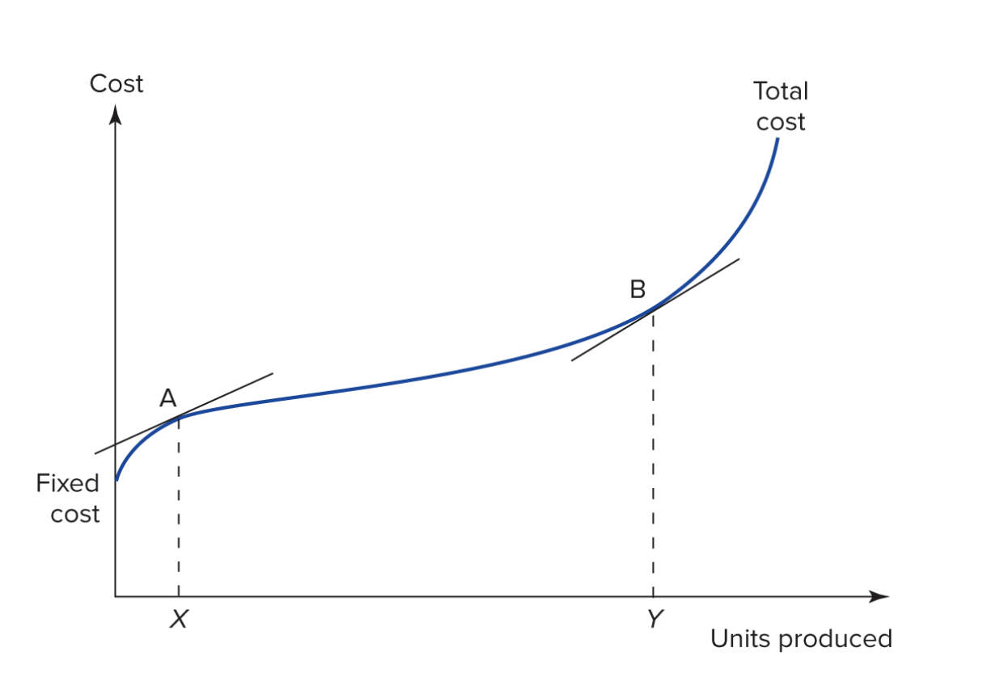

# Questions:

## Question 1: 

> I hope Prof can review the viable system model, the economic significance of
> non-linearities and interactions, the slight difference between incremental
> cost and marginal cost, and synergy in sharing capital.

> It would be better if Prof can provide sample mid-term questions for revision.

## Question 2: 

> All pls 

## Question 3: 

> Non-linear problems

## Note: 

- Six students started, but did not submit, their surveys. If you think you
asked a question, but it does not appear in this list, you may have forgotten to
submit your question. 

# Details on Student Q1:

## Review the VSM: 

- This point is largely covered in section XXXX 

## Economic significance of non-linearities. 

- This is a topic that comes up in our discussing of estimating cost curves. (LINK)
- As a general matter, non-linearity is a property of a function, so the economic significance of the non-linearity depends on the function that you are considering.

## Economic significance of interactions.

- This topic comes up in the discussion of cost functions with interactions between two products. 
  - LINK 
  - In general, if $y = f(x_1,x_2)$ if there is an interaction then the effect of each of the interacted variables (the 'x' variables) on the value of the function depends on the level of the other variable. 
  - i.e. if $y = x_1\times x_2$ then the effect of $x_1$ on $y$ depends on the level of $x_2$.
  - This means that the function is not _separable_. We cannot separate the effects of the two variables from each other. 
  - In cost functions this means that we cannot calculate separate average costs for the two.

## Side note: 

__Interactions are non-linearities.__ 

- $y=x_1\times x_2$ is non-linear.
- $y=x_1^2$ is non-linear. 
- Both are the product of variables: 
  - $y=x_1\times x_2$
  - $y=x_1\times x_1$

## The difference between incremental cost and marginal cost

- IC is slope between two points on the cost curve (usually one unit).
- MC is the slope of a line tangent to a single point on the cost curve. 
- IC=MC when the curve is linear. In this case there is no difference.
- The difference between the two matters more when a unit is large relative to the change in marginal cost.
- We can identify these places in the following figure from Lecture 2: 

## Cost curve from Session 2: 

## Synergy in sharing capital: 

- Synergy is a broad term for beneficial interactions between products or business units. 
- Shared capital is one example. 
- In the example we did in class we had shared capital the meant that we could purchase capital for one product and then use it to make another product without having to repurchase it. 
- This is a source of non-linearity.
