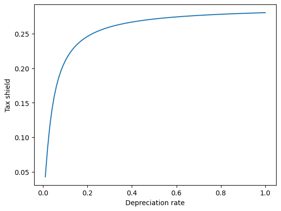
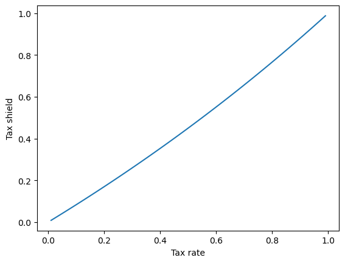

## Tax Shields and Net-of-tax returns on real and financial assets

### Key concepts from last time

1. Assets, investments, and projects all have different pre-tax returns ($r$).
2. Tax rates ($t$) vary across individuals, jurisdictions, organizations, and assets.

## Examples of 2.
- HK individual income tax ranges from 2% to 17%
- HK corporate tax is 16.5% 
- US individual income tax ranges from 10% to 35%
  - Mortgage interest is not taxed.
- US corporate tax rate was 35% until 2017, now 21%
    - Investments (depreciation) are tax deductible 
    - Interest payments are tax deductible
    
- _Note: non-Hong Kong tax laws are important for Hong Kong accountants, because these laws are often __the reason__ why your clients/employers are doing business in Hong Kong._

### Key concepts from last time

1. Assets, investments, and projects all have different pre-tax returns ( $r$ ).
2. Tax rates ( $t$ ) vary across individuals, jurisdictions, organizations, and assets.
3. pre-tax returns of $r$ correspond to post-tax returns of $r(1-t)$ 
   - for simple assets like savings accounts, money market funds and mutual funds.

## Notice some thing similar for more complex assets

|      |      Instrument     |  <div style="width:400px">Annualized Return</div>              |
|------|-------------------------------|-------------------------------|
| I.   |  Money Market Fund  |  $r(1-t)$                      |
| II.  |         SPDA        |  $[(1+r)^{n}(1-t)+t]^{1/n} -1$ |
| III. |     Mutual Fund     |  $r(1 - g)$                    |
| IV.  | Foreign Corporation |$[(1+r)^{n}(1-g)+g]^{1/n} -1$ |
| V.   |   Insurance Policy  |$r$                           |
| VI.  |       Pension       |$r$                           |

1. Note: SPDAs and "Foreign" Corporations differ because taxes are paid on the income when you end the position.
2. Note: That these are 'annualized' rates meaning the rate of return for each year.
3. $r$ is the interest rate, $t$ is the income tax rate, and $g$ is the capital gains rate.

### Key concepts from last time

1. Assets, investments, and projects all have different pre-tax returns ($r$).
2. Tax rates $t$ vary across individuals, jurisdictions, organizations, and assets.
3. pre-tax returns $r$ correspond to post tax returns $r(1-t)$ 
4. When preferential tax treatment increases demand for a tax favored asset it's price increases. This price change is an _implicit_ tax.
5. When tax payers use organizational forms like pensions and insurance policies to avoid taxes it is called _organizational form arbitrage_.
6. When high-tax tax payers issue taxable debt to finance the purchase of tax free debt (e.g. municipal bonds in the US) issued by low-tax tax payers (e.g. US non-profit universities) it is called _clientele arbitrage_.

## Let's look at the case (only 4:30 section)

1. We are using an SPDA to illustrate a context in which a normal investor could implement a strategy like this.
2. No need to memorize the SPDA formula.
3. When comparing two options, always think about the revenue and costs that are __unique__ to each scenario.

([Excel Example](https://arthurhowardmorris.github.io/resources/semesters/s2025/ACCTG3210.html#lecture-8-taxation-of-returns))

[iPRS](https://iprs.ust.hk/ars/session/index/2560)

## Now back to net-of-tax returns

Suppose there is a __riskless financial__ asset that costs one dollar at the
beginning of the period and pays $1 + r$ dollars at the end of every period.
The difference, $r$, is taxed at rate $t$.

Thus, it is possible to borrow and lend at the after-tax rate of $r(1 - t)$ per
period. 

There is also a __real asset__ costing $x > 0$. The asset produces a
riskless pretax cash flow of $k$ in perpetuity at the end of each period. 


## Tax Treatment of Depreciation:

For tax purposes, the original cost of the asset may be depreciated straight
line at rate $0 \leq d \leq 1$. Taxable income for any period is the pre-tax cash flow
less the depreciation.

- [Hong Kong Tax Treatment of depreciation is slightly more complicated than this, with a lump depreciation in year 0 and various linear rates thereafter.](https://taxsummaries.pwc.com/hong-kong-sar/corporate/deductions)


__But wait!?!? Didn't you just tell us not to consider depreciation?__

- _Why are we including depreciation?_
- _Notice where we include depreciation in the next equation!_

Tax is paid at rate $t$, so that at the end of the first
period, the net-of-tax cash flow is

$$k-t(k-dx)$$

- $k$ is the return on the investment, $d$ is the depreciation rate, and $x$ is the investment.

Depreciation is impacting cash flow through it's impact on __the taxes you pay__!

## Tax Treatment of Depreciation:

We can rewrite the net-of-tax cash flow equation above as follows:

$$k(1-t) + dtx$$

Now lets write down the cash flows from this project, and discount them.

## What are the cash flows?

The cash outflow $x$ to acquire the asset is not tax deductible, so the first cash flow is just:

$$-x$$

## What are the cash flows?

- The second set of cash flows are the net-of-tax cash flows over the depreciable life of the asset discounted back to time zero at the after-tax rate of return

$$ \sum^{1/d}_{n=1}\frac{k(1-t)+dtx}{[1+r(1-t)]^{n}}$$


- $1/d$ is the number of periods you depreciate. e.g. if $d=.25$ then $1/d=4$ years
- the numerators are discounting cash flows relative with $r$ adjusted for $t$ you might recognize the formula from the previous lecture's handout!

## What are the cash flows?

The final set of cash flows we need to consider are then net-of-tax cash flows from the asset after the asset is fully depreciated. 

$$\sum^{\infty}_{n=1+1/d}\frac{k(1-t)}{[1+r(1-t)]^{n}}$$

- $1/d$ is the number of periods you depreciate. e.g. if $d=.25$ then $1/d=4$ years
- the numerators are discounting cash flows relative with $r$ adjusted for $t$ you might recognize the formula from the previous lecture's handout!

__So the total net-of-tax present value of these cash flows at the end of the first period is:__
$$-x + \sum^{1/d}_{n=1}\frac{k(1-t)+dtx}{[1+r(1-t)]^{n}}+\sum^{\infty}_{n=1+1/d}\frac{k(1-t)}{[1+r(1-t)]^{n}}$$

- $1/d$ is the number of periods you depreciate. e.g. if $d=.25$ then $1/d=4$ years
- the numerators are discounting cash flows relative with $r$ adjusted for $t$ you might recognize the formula from the previous lecture's handout!

#### This quantity can be rewritten as follows: 

$$-x+\frac{k}{r}+\frac{dtx}{r(1-t)}\Big(1-[1+r(1-t)]^{-1/d}\Big)$$

This is using the annuity and perpetuity formulas.

#### Each of these terms has an important meaning: 

$$-x+\frac{k}{r}+\frac{dtx}{r(1-t)}\Big(1-[1+r(1-t)]^{-1/d}\Big)$$

The __first term__ is the cost of the asset again.

#### Each of these terms has an important meaning:

$$-x+\frac{k}{r}+\frac{dtx}{r(1-t)}\Big(1-[1+r(1-t)]^{-1/d}\Big)$$

The __second term__ is the present value of the perpetual pre-tax cash flow from
the asset, $k$, capitalized at the pre-tax rate, $r$. Note that this is the
same as the after tax cash flow, $k(1-t)$, capitalized at the after tax
discount rate, $r(1-t)$.

#### Each of these terms has an important meaning:

$$-x+\frac{k}{r}+\frac{dtx}{r(1-t)}\Big(1-[1+r(1-t)]^{-1/d}\Big)$$

- The __final term__ is the present value of the reduction in tax payments afforded by the depreciation deduction (often called the __tax shield__).
- Notice that this term has the same form as the present value of an annuity of $dtx$ for $1/d$ periods discounted at rate $r(1-t)$.
- __This is the only term where tax factors $d$ and $t$ play a role.__


- If either the depreciation rate or the tax rate is zero, then the before tax and net-of-tax present values are the same.
- If $d$ and $t$ are both positive then the value of the tax shield provided by depreciation is also positive. The value of the shield increases with both $d$ and $t$.

- If either the depreciation rate or the tax rate is zero, then the before tax and net-of-tax present values are the same.
- If $d$ and $t$ are both positive then the value of the tax shield provided by depreciation is also positive. The value of the shield increases with both $d$ and $t$.
- When tax depreciation is immediate, i.e., $d=1$, then the tax shield is 

$$\frac{dtx}{r(1-t)}\Big(1-[1+r(1-t)]^{-1/d}\Big)=x\frac{t}{1+r(1-t)}$$

- If either the depreciation rate or the tax rate is zero, then the before tax and net-of-tax present values are the same.
- If $d$ and $t$ are both positive then the value of the tax shield provided by depreciation is also positive. The value of the shield increases with both $d$ and $t$.
- When tax depreciation is immediate, i.e., $d=1$, then the tax shield is 

$$\frac{dtx}{r(1-t)}\Big(1-[1+r(1-t)]^{-1/d}\Big)=x\frac{t}{1+r(1-t)}$$

- This value can be substantial. Consider an investment that may be deducted fully from taxes in the year it is made, such as advertising. For $t=30\%$ and $r=10\%$, the tax shield is 28\% of the cost of the asset!

## Let's do some plotting to get a sense of this relationship

$$\frac{dtx}{r(1-t)}\Big(1-[1+r(1-t)]^{-1/d}\Big)=x\frac{t}{1+r(1-t)}$$

First let's plot the value of the tax shield as a function of the depreciation rate.
Assume that $r=10\%$, and $t=30\%$


```python
import matplotlib.pyplot as plt
import numpy as np

def tax_shield(d,t,r,x=1):
    first_term = (d*x*t)/(r*(1-t))
    second_term = 1-(1+r*(1-t))**(-1/d)
    return first_term*second_term
```

First let's plot the value of the tax shield as a function of the depreciation rate.
Assume that $r=10\%$, and $t=30\%$


```python
D = np.linspace(0.01,1,100)
plt.plot(D,tax_shield(D,t=0.3,r=0.1))
plt.xlabel('Depreciation rate')
plt.ylabel('Tax shield')
plt.show()
```


    

    


First let's plot the value of the tax shield as a function of the depreciation rate.
Now let's plot the value of the tax shield as a function of the tax rate.
Assume that $r=10\%$, and $d=30\%$


```python
import warnings
warnings.filterwarnings('ignore')
```


```python
T = np.linspace(0.01,1,100)
plt.plot(T,tax_shield(d=0.3,t=T,r=0.1))
plt.xlabel('Tax rate')
plt.ylabel('Tax shield')
plt.show()
```


    

    


#### One surprising conclusion that might be drawn from this analysis is that the net-of-tax present value of an investment is increasing in t.

#### That is, the higher the tax rate, the more attractive is the investment!

## This might be the point!
- The depreciation tax shield makes investment more attractive.
- Investment encourages economic growth.

## Questions:

1. The statement above is a striking one. What must be held constant (and probably is not in real life) for it to be true?
2. What condition defines equilibrium prices and returns on financial assets relative to real assets?
3. What opportunities would you be able to exploit if you observed that prices and returns were not in equilibrium?
4. What effect would your actions tend to have on prices and returns?
5. Tricky question. What happens of the value of the depreciation tax shield as the tax rate, t approaches 100%? What is the intuition behind this result?


## Questions:

1. The statement above is a striking one. What must be held constant (and probably is not in real life) for it to be true?
    - The demand for real assets! (implicit tax)
    - Government spending may crowd out other types of investment.
    - Also returns to scale.
2. What condition defines equilibrium prices and returns on financial assets relative to real assets?
    - No risk-free return from converting one to the other (no arbitrage) 
4. What opportunities would you be able to exploit if you observed that prices and returns were not in equilibrium?
    - Arbitrage! 
6. What effect would your actions tend to have on prices and returns?
    - Push them back to equilibrium.

## Questions cont'd:

8. Tricky question. What happens to the value of the value of the depreciation tax shield as the tax rate, t approaches 100%? What is the intuition behind this result?
   - 100% of the value of the asset is as a tax shield.


```python
tax_shield(d=0.3,t=.999999999,r=0.1)
```


    1.0000001100223055


```python
# TODO: add a slide for the value of a tax shield in hong kong
```
