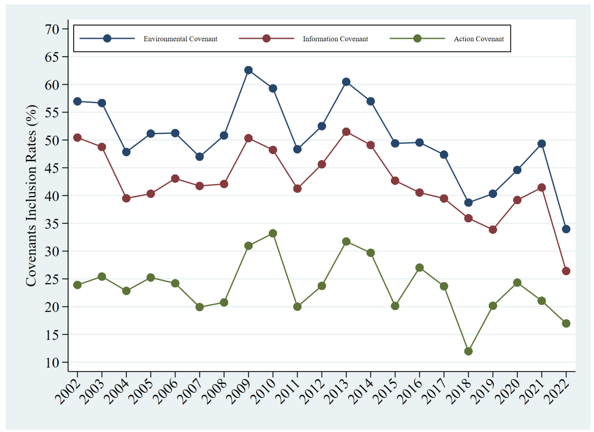

--- 
title: "Pollution, Specialization, and Uncertainty: The Use and Design of Environmental Covenants in Debt Contracts"
author: "Ting Dai, Daniele Macciocchi, Arthur Morris"
institute: "The Hong Kong University of Science and Technology Miami Herbert Business School, The University of Miami"
---

## Do banks care about their borrowers' pollution?

__Three potential reasons:__

- Banks <3 planet.
- Banks greenwash.
- Banks are concerned about the impact of pollution on the

## How do banks influence their borrowers' pollution?

__Environmental Covenants__

- The terms of the debt contract can include pollution related terms.
- We gather and classify these contract terms from the public filings of U.S.
firms.
- Categories: Action, Information, Compliance.

## Covenant Types

- Action Covenants: Require the borrower to take specific actions to remediate pollution.
- Information Covenants: Require the borrower to disclose information about pollution.
- Compliance Covenants: Require the borrower to comply with environmental laws
and regulations. (These are in all contracts.)

## Action Covenant

> _"if the Administrative Agent or any Lender has formed a reasonable belief
> that material violations of Environmental Laws may exist or Hazardous
> Materials may be present on the Real Property in amounts or under
> circumstances which could reasonably be expected to result in a liability
> exceeding a Material Environmental Amount, then,"_
>
> _"\[perform\] of any cleanup, remediation, containment, operation, maintenance,
> monitoring or restoration work, whether on or off of the Real Property"_
>
> _"restore the Real Property to the maximum extent practicable, which shall
> include, without limitation, the repair of any surface damage."_

## Information Covenant

> _"The Borrower will, and will cause each of its Subsidiaries to, permit any
> representatives designated by the Administrative Agent or any Lender, upon
> reasonable prior notice, to visit and inspect its properties, to examine and
> make extracts from its books and records, including environmental assessment
> reports and Phase I or Phase II studies,"_

## Compliance Covenant

> _"The Borrower will, and will cause each of its Subsidiaries to, comply with
> all laws, rules, regulations and orders of any Governmental Authority
> applicable to it or its property (including, without limitation, ERISA and
> Environmental Laws)"_

## Covenant Use Over Time

{width=60%}

## Time Trend

- Explanations of covenant use cannot be explained by recent trends in opinion.

## Main Question

- Does the type and location of the pollution matter?
- Should not matter if banks <3 the planet, or greenwash.
- If banks are concerned about the value of their collateral, then the use of
covenants should depend on the type of pollution that the firm produces.

## Pollution Data

- We supplement the loan data with EPA TRI data.
- Pollution is recorded by type and location:
  - Land, Air, Water.
  - On-site, Off-site.

## Findings

- Only on-site land and water pollution matters.
- __Banks appear to be concerned with the value of the assets that they can
recover in bankruptcy.__

## Implications for policy

- Banks monitor pollution _only_ to the extent that pollution degrades the
expected value of their assets.
- __Regulators remain essential for internalizing pollution-related externalities.__

<!-- {width=60%} -->
<!--  -->

<!-- 
 -->
  <!--  -->
<!-- 
 -->
